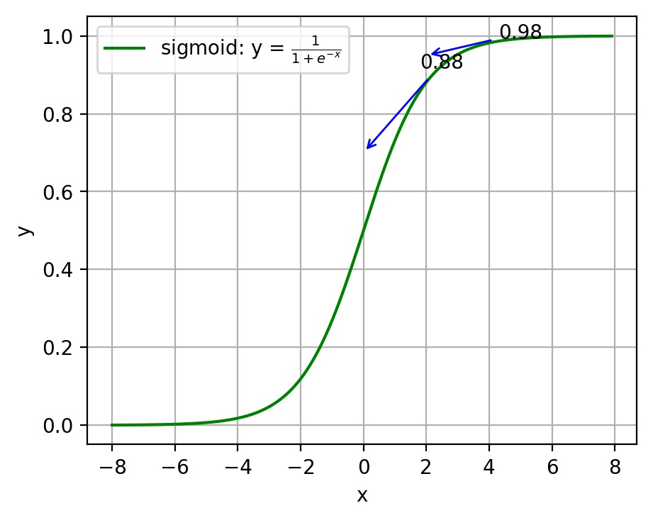
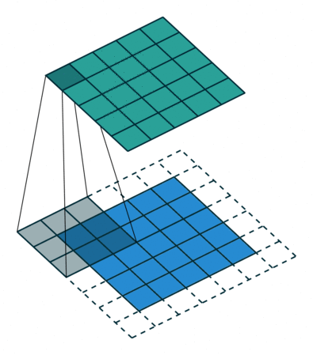
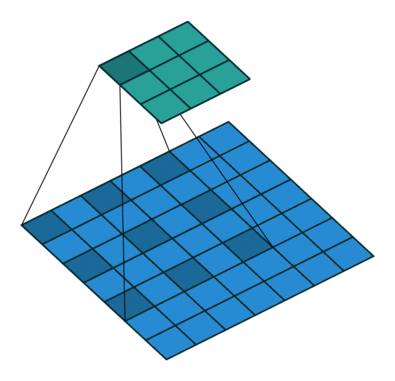
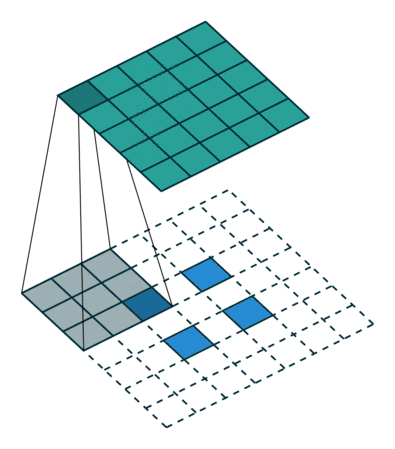
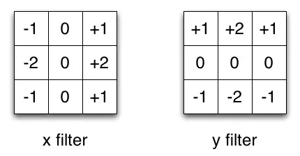
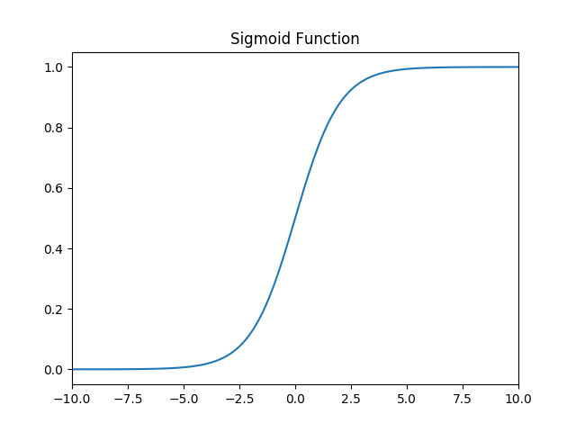
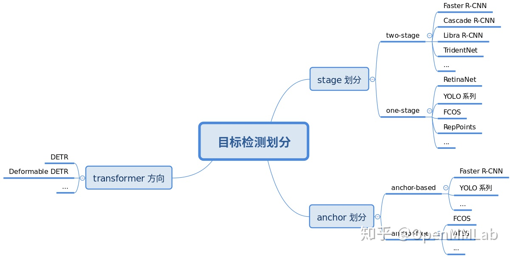

## L1.基础知识

### M1.评价指标

#### s1.正确率（accuracy）

accuracy = (TP+TN)/(P+N)

正确率是**被分对的样本数在所有样本数中的占比**，通常来说，正确率越高，分类器越好。

#### s2.召回率（recall 检出率）

recall=TP/(TP+FN)=TP/P=sensitivity: 正确的正例/所有正例

度量有多个正例被分为正例

#### s3.精度（precision 检准率）

precision=TP/(TP+FP) : 正确的正例/预测的正例

精度是精确性的度量，表示被分为正例的示例中实际为正例的比例。

#### s4.F1

精度和召回率反映了分类器分类性能的两个方面。如果综合考虑查准率与查全率，可以得到新的评价指标F1-score，也称为综合分类率：$F1=\frac{2 \times precision \times recall}{precision + recall}$​。

#### s5.PR曲线

**ROC**曲线是（Receiver Operating Characteristic Curve，受试者工作特征曲线）的简称，是以灵敏度（真阳性率）为纵坐标，以1减去特异性（假阳性率）为横坐标绘制的性能评价曲线，ROC曲线越靠近左上角，说明其对应模型越可靠。
$$
TPR = \frac{TP}{P} = \frac{TP}{TP+FN},
FPR = \frac{FP}{N} = \frac{FP}{FP+TN}
$$
ROC曲线围成的面积 (即**AUC**)可以解读为：从所有正例中随机选取一个样本A，再从所有负例中随机选取一个样本B，分类器将A判为正例的概率比将B判为正例的概率大的可能性。

PR不同点是ROC曲线使用了FPR，而PR曲线使用了Precision

ROC曲线由于兼顾正例与负例，所以适用于评估分类器的整体性能，相比而言PR曲线完全聚焦于正例。

### M2.损失函数

#### s1.均方差损失

$$
J = \frac{1}{2n}\sum_x\Vert y(x)-a^L(x)\Vert^2
$$

$$
\frac{\partial J}{\partial w}=(y-a)\sigma'(z)x\;,
\frac{\partial J}{\partial b}=(y-a)\sigma'(z)
$$

#### s2.交叉熵损失

$$
C=-\frac{1}{n}\sum[ylna+(1-y)ln(1-a)]
$$

求导：https://blog.csdn.net/jasonzzj/article/details/52017438

### M3.模型评估

#### s1.模型欠拟合

在训练集以及测试集上同时具有较高的误差，此时模型的偏差较大；

1. 添加其他特征项。组合、泛化、相关性、上下文特征、平台特征等特征是特征添加的重要手段，有时候特征项不够会导致模型欠拟合。
2. 添加多项式特征。例如将线性模型添加二次项或三次项使模型泛化能力更强。例如，FM（Factorization Machine）模型、FFM（Field-aware Factorization Machine）模型，其实就是线性模型，增加了二阶多项式，保证了模型一定的拟合程度。
3. 可以增加模型的复杂程度。
4. 减小正则化系数。正则化的目的是用来防止过拟合的，但是现在模型出现了欠拟合，则需要减少正则化参数。

#### s2.模型过拟合

在训练集上具有较低的误差，在测试集上具有较高的误差，此时模型的方差较大。

1. 重新清洗数据，数据不纯会导致过拟合，此类情况需要重新清洗数据。 
2. 增加训练样本数量。 
3. 降低模型复杂程度。 
4. 增大正则项系数。 
5. 采用dropout方法，dropout方法，通俗的讲就是在训练的时候让神经元以一定的概率不工作。 
6. early stopping。 
7. 减少迭代次数。 
8. 增大学习率。 
9. 添加噪声数据。 
10. 树结构中，可以对树进行剪枝。 
11. 减少特征项。
12. **Batch Normalization**
13. 模型集成

### M4.神经网络

#### s1.卷积计算公式

$$
W_2 = (W_1 - F + 2P)/S + 1\\
$$

#### s2.Pooling

Pooling 层主要的作用是下采样，通过去掉 Feature Map 中不重要的样本，进一步减少参数数量。Pooling 的方法很多，最常用的是 Max Pooling。卷积层核池化层在结构上具有一定的相似性，都是对感受域内的特征进行提取，并且根据步长设置获取到不同维度的输出，但是其内在操作是有本质区别的，如表5.7所示。

|            |                 卷积层                 |              池化层              |
| :--------: | :------------------------------------: | :------------------------------: |
|  **结构**  |   零填充时输出维度不变，而通道数改变   |  通常特征维度会降低，通道数不变  |
| **稳定性** | 输入特征发生细微改变时，输出结果会改变 | 感受域内的细微变化不影响输出结果 |
|  **作用**  |        感受域内提取局部关联特征        |  感受域内提取泛化特征，降低维度  |
| **参数量** |      与卷积核尺寸、卷积核个数相关      |          不引入额外参数          |

#### s3.卷积类别

|            卷积类别            |                            示意图                            | 作用                                                         |
| :----------------------------: | :----------------------------------------------------------: | :----------------------------------------------------------- |
|            标准卷积            |  | 最常用的卷积核，连续紧密的矩阵形式可以提取图像区域中的相邻像素之间的关联关系，$3\times3$的卷积核可以获得$3\times3$像素范围的感受视野 |
| 扩张卷积（带孔卷积或空洞卷积） |   | 引入一个称作扩张率（Dilation Rate）的参数，使同样尺寸的卷积核可以获得更大的感受视野，相应的在相同感受视野的前提下比普通卷积采用更少的参数。同样是$3\times3$的卷积核尺寸，扩张卷积可以提取$5\times5$范围的区域特征，在实时图像分割领域广泛应用 |
|            转置卷积            |   | 先对原始特征矩阵进行填充使其维度扩大到适配卷积目标输出维度，然后进行普通的卷积操作的一个过程，其输入到输出的维度变换关系恰好与普通卷积的变换关系相反，但这个变换并不是真正的逆变换操作，通常称为转置卷积(Transpose Convolution)而不是反卷积(Deconvolution)。转置卷积常见于目标检测领域中对小目标的检测和图像分割领域还原输入图像尺度。 |
|           可分离卷积           |  | 标准的卷积操作是同时对原始图像$H\times W\times C$三个方向的卷积运算，假设有$K$个相同尺寸的卷积核，这样的卷积操作需要用到的参数为$H\times W\times C\times K$个；若将长宽与深度方向的卷积操作分离出变为$H\times W$与$C$的两步卷积操作，则同样的卷积核个数$K$，只需要$(H\times W + C)\times K$个参数，便可得到同样的输出尺度。可分离卷积(Seperable Convolution)通常应用在模型压缩或一些轻量的卷积神经网络中，如MobileNet$^{[1]}$、Xception$^{[2]}$等。**相当于先生成同样大小，再进行通道对其** https://zhuanlan.zhihu.com/p/92134485 |

空洞卷积问题：

- **局部信息丢失**：由于空洞卷积的计算方式类似于棋盘格式，某一层得到的卷积结果，来自上一层的独立的集合，没有相互依赖，因此该层的卷积结果之间没有相关性，即局部信息丢失。
- **远距离获取的信息没有相关性**：由于空洞卷积稀疏的采样输入信号，使得远距离卷积得到的信息之间没有相关性，影响分类结果。

#### s4.1x1卷积

- 实现信息的跨通道交互和整合。
- 对卷积核通道数进行降维和升维，减小参数量。

### M5.激活函数

1. 激活函数对模型学习、理解非常复杂和非线性的函数具有重要作用。

2. 激活函数可以引入非线性因素。如果不使用激活函数，则输出信号仅是一个简单的线性函数。线性函数一个一级多项式，线性方程的复杂度有限，从数据中学习复杂函数映射的能力很小。没有激活函数，神经网络将无法学习和模拟其他复杂类型的数据，例如图像、视频、音频、语音等。

3. 激活函数可以把当前特征空间通过一定的线性映射转换到另一个空间，让数据能够更好的被分类。

4. 对常见激活函数，导数计算如下：

   | 原函数          | 函数表达式                                   | 导数                                                         | 备注                                                         |
   | --------------- | -------------------------------------------- | ------------------------------------------------------------ | ------------------------------------------------------------ |
   | Sigmoid激活函数 | $f(x)=\frac{1}{1+e^{-x}}$                    | $f^{'}(x)=\frac{1}{1+e^{-x}}\left( 1- \frac{1}{1+e^{-x}} \right)=f(x)(1-f(x))$ | 当$x=10$,或$x=-10$，$f^{'}(x) \approx0$,当$x=0$$f^{'}(x) =0.25$ |
   | Tanh激活函数    | $f(x)=tanh(x)=\frac{e^x-e^{-x}}{e^x+e^{-x}}$ | $f^{'}(x)=-(tanh(x))^2$                                      | 当$x=10$,或$x=-10$，$f^{'}(x) \approx0$,当$x=0$$f^{`}(x) =1$ |
   | Relu激活函数    | $f(x)=max(0,x)$                              | $c(u)=\begin{cases} 0,x<0 \\ 1,x>0 \\ undefined,x=0\end{cases}$ | 通常$x=0$时，给定其导数为1和0                                |

#### s1.sigmoid 

函数的定义为：$ f(x) = \frac{1}{1 + e^{-x}} $，其值域为 $ (0,1) $。

#### s2.tanh

函数的定义为：$ f(x) = tanh(x) = \frac{e^x - e^{-x}}{e^x + e^{-x}} $，值域为 $ (-1,1) $。

#### s3.Relu

函数的定义为：$ f(x) = max(0, x) $  ，值域为 $ [0,+∞) $；

1. 可以使网络训练更快。

 相比于sigmoid、tanh，导数更加好求，反向传播就是不断的更新参数的过程，因为其导数不复杂形式简单。

2. 增加网络的非线性。

 本身为非线性函数，加入到神经网络中可以是网格拟合非线性映射。

3. 防止梯度消失。

对于深度神经网络，sigmoid函数反向传播时，很容易就出现梯度消失的情况（比如sigmoid函数接近饱和区时，变换太缓慢，导数趋于0，这种情况就会造成信息消失），从而无法完成深层网络的训练。**梯度弥散**

4. 使网格具有稀疏性。

由于小于0部分为0，大于0部分才有值，所以可以减少过拟合。

训练的时候很”脆弱”，很容易就”die”了，训练过程该函数不适应较大梯度输入，因为在参数更新以后，ReLU的神经元不会再有激活的功能，导致梯度永远都是零。

#### s4.Leak Relu

函数定义为： $ f(x) =  \left\{
\begin{aligned}
ax, \quad x<0 \\
x, \quad x>0
\end{aligned}
\right. $，值域为 $ (-∞,+∞) $。 

图像如下（$ a = 0.5 $）：

#### s5. SoftPlus 

函数的定义为：$ f(x) = ln( 1 + e^x) $，值域为 $ (0,+∞) $。

#### s7.softmax

函数定义为： $ \sigma(z)_j = \frac{e^{z_j}}{\sum_{k=1}^K e^{z_k}} $。

Softmax 多用于多分类神经网络输出。

### M6. 归一化

1. 加快网络的训练和收敛的速度

   加快收敛速度：在深度神经网络中中，如果每层的数据分布都不一样的话，将会导致网络非常难收敛和训练，而如果把 每层的数据都在转换在均值为零，方差为1 的状态下，这样每层数据的分布都是一样的训练会比较容易收敛。

2. 控制梯度爆炸防止梯度消失

3. 防止过拟合

   在网络的训练中，BN的使用使得一个minibatch中所有样本都被关联在了一起，因此网络不会从某一个训练样本中生成确定的结果，即同样一个样本的输出不再仅仅取决于样本的本身，也取决于跟这个样本同属一个batch的其他样本，而每次网络都是随机取batch，这样就会使得整个网络不会朝这一个方向使劲学习。一定程度上避免了过拟合。

#### s1 线性归一化

$$
x^{\prime} = \frac{x-min(x)}{max(x) - min(x)}
$$

适用范围：比较适用在数值比较集中的情况。

​	缺点：如果 max 和 min 不稳定，很容易使得归一化结果不稳定，使得后续使用效果也不稳定。

#### s2. 标准差标准化

$$
x^{\prime} = \frac{x-\mu}{\sigma}
$$

​	含义：经过处理的数据符合标准正态分布，即均值为 0，标准差为 1 其中 $ \mu $ 为所有样本数据的均值，$ \sigma $​ 为所有样本数据的标准差。

#### s3. 非线性归一化

适用范围：经常用在数据分化比较大的场景，有些数值很大，有些很小。通过一些数学函数，将原始值进行映射。该方法包括 $ log $​、指数，正切等。

#### s4. 局部相应归一化（LRU）

#### s5. 批归一化（BN）

**优点**

在神经网络中间层也进行归一化处理，使训练效果更好的方法，就是批归一化Batch Normalization（BN）。

1. 减少了人为选择参数。在某些情况下可以取消 dropout 和 L2 正则项参数,或者采取更小的 L2 正则项约束参数； 
2. 减少了对学习率的要求。现在我们可以使用初始很大的学习率或者选择了较小的学习率，算法也能够快速训练收敛； 
3. 可以不再使用局部响应归一化。BN 本身就是归一化网络(局部响应归一化在 AlexNet 网络中存在) 
4. 破坏原来的数据分布，一定程度上缓解过拟合（防止每批训练中某一个样本经常被挑选到，文献说这个可以提高 1% 的精度）。 
5. 减少梯度消失，加快收敛速度，提高训练精度。

**过程**

输入：上一层输出结果 $ X = {x_1, x_2, ..., x_m} $，学习参数 $ \gamma, \beta $

算法流程：

1. 计算上一层输出数据的均值

$$
\mu_{\beta} = \frac{1}{m} \sum_{i=1}^m(x_i)
$$

其中，$ m $ 是此次训练样本 batch 的大小。

2. 计算上一层输出数据的标准差

$$
\sigma_{\beta}^2 = \frac{1}{m} \sum_{i=1}^m (x_i - \mu_{\beta})^2
$$

3. 归一化处理，得到

$$
\hat x_i = \frac{x_i + \mu_{\beta}}{\sqrt{\sigma_{\beta}^2} + \epsilon}
$$

其中 $ \epsilon $ 是为了避免分母为 0 而加进去的接近于 0 的很小值

4. 重构，对经过上面归一化处理得到的数据进行重构，得到

$$
y_i = \gamma \hat x_i + \beta
$$

**$ \gamma, \beta $​ 为可学习参数。**

注：上述是 BN 训练时的过程，但是当在投入使用时，往往只是输入一个样本，没有所谓的均值 $ \mu_{\beta} $ 和标准差 $ \sigma_{\beta}^2 $。此时，均值 $ \mu_{\beta} $ 是计算所有 batch $ \mu_{\beta} $ 值的平均值得到，标准差 $ \sigma_{\beta}^2 $ 采用每个batch $ \sigma_{\beta}^2 $​  的无偏估计得到。

简单直接白化引入了太多的人工设计，使输入强行归一化，对于原始图像来说这样直接处理还行，但是越是到了网络的深层，CNN提取出来的特征就越是无法解释，那么同样的白化操作就变得不合理，所以BN在白化之后引入了两个参数控制白化的程度，它刚刚好使白化的逆过程，而且，这两个参数是参与训练的，那么一种极端的可能就是，白化如果对结果没有作用，那么$ \gamma, \beta $很有可能将白化后的结果恢复成原来的样子。

**conv+bn+relus顺序**: 从[数据饱和区](https://www.zhihu.com/question/318354788)的角度讲有比较好的讨论，即如果先进行relu，那么在bn的时候有些单元已经失活了，造成bn不稳定，影响模型性能；bn将数据分布进行标准化，使数据回到非饱和区，然后在经过relu可以控制激活的饱和程度。这里可以假设从conv出来的数据很大部分进入失活，那么先relu再bn的结果就不稳定了。因此应该将置于relu之前。

**融合cn**

训练时，均值、方差分别是该批次内数据相应维度的均值与方差；

推理时，均值、方差是基于所有批次的期望计算所得，滑动平均
$$
\begin{align*}
y_{conv} &= w \cdot x + b \\
y_{bn} &= \gamma \cdot \left (\frac{y_{conv} - E[x]}{\sqrt{Var[x] + \epsilon}} \right)+\beta \\
&= \gamma \cdot \left (\frac{wx+b - E[x]}{\sqrt{ Var[x] + \epsilon}} \right)+\beta \\
\hat w &= \frac{\gamma}{\sqrt{Var[x] + \epsilon}}\cdot w \\
\hat b &= \frac{\gamma}{\sqrt{Var[x] + \epsilon}}\cdot \left({b - E[x]} \right)+\beta \\
y_{bn} &= \hat w \cdot x + \hat b \\
\end{align*}
$$

### M7. 正则化

### M8. 数据增强

- Color Jittering：对颜色的数据增强：图像亮度、饱和度、对比度变化（此处对色彩抖动的理解不知是否得当）；

- PCA  Jittering：首先按照RGB三个颜色通道计算均值和标准差，再在整个训练集上计算协方差矩阵，进行特征分解，得到特征向量和特征值，用来做PCA Jittering；

- Random Scale：尺度变换；

- Random Crop：采用随机图像差值方式，对图像进行裁剪、缩放；包括Scale Jittering方法（VGG及ResNet模型使用）或者尺度和长宽比增强变换；

- Horizontal/Vertical Flip：水平/垂直翻转；

- Shift：平移变换；

- Rotation/Reflection：旋转/仿射变换；

- Noise：高斯噪声、模糊处理；

- Label Shuffle：类别不平衡数据的增广；

## L2.机器学习

### M1.聚类

要的聚类算法可以划分为如下几类：划分方法、层次方法、基于密度的方法、基于网格的方法以及基于模型的方法。下面主要对k-means聚类算法、凝聚型层次聚类算法、神经网络聚类算法之SOM,以及模糊聚类的FCM算法通过通用测试数据集进行聚类效果的比较和分析。

#### s1.k-means

k-means是划分方法中较经典的聚类算法之一。由于该算法的效率高，所以在对大规模数据进行聚类时被广泛应用。目前，许多算法均围绕着该算法进行扩展和改进。
k-means算法以k为参数，把n个对象分成k个簇，使簇内具有较高的相似度，而簇间的相似度较低。k-means算法的处理过程如下：首先，随机地 选择k个对象，每个对象初始地代表了一个簇的平均值或中心;对剩余的每个对象，根据其与各簇中心的距离，将它赋给最近的簇;然后重新计算每个簇的平均值。 这个过程不断重复，直到准则函数收敛。通常，采用平方误差准则，其定义如下：
$$
E=\sum_{i=1}^{k}\sum_{p\in C_i}\left\|p-m_i\right\|^2
$$
　这里E是数据中所有对象的平方误差的总和，p是空间中的点，$m_i$是簇$C_i$​的平均值[9]。该目标函数使生成的簇尽可能紧凑独立，使用的距离度量是欧几里得距离，当然也可以用其他距离度量。

#### s2.层次聚类算法

​    根据层次分解的顺序是自底向上的还是自上向下的，层次聚类算法分为凝聚的层次聚类算法和分裂的层次聚类算法。
　凝聚型层次聚类的策略是先将每个对象作为一个簇，然后合并这些原子簇为越来越大的簇，直到所有对象都在一个簇中，或者某个终结条件被满足。绝大多数层次聚类属于凝聚型层次聚类，它们只是在簇间相似度的定义上有所不同。

**算法流程**：

注：以采用最小距离的凝聚层次聚类算法为例：

　(1) 将每个对象看作一类，计算两两之间的最小距离；
　(2) 将距离最小的两个类合并成一个新类；
　(3) 重新计算新类与所有类之间的距离；
　(4) 重复(2)、(3)，直到所有类最后合并成一类。

##  L3.目标检测

### M1.模型大类

#### s1.RCNN

#### s2.YOLO

#### s3.SSD

