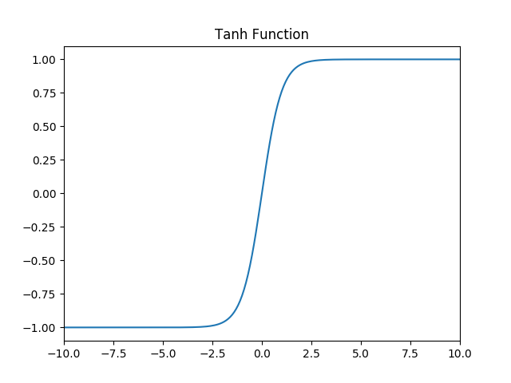

## L1.基础知识


### M1.评价指标


#### s1.正确率（accuracy）

accuracy = (TP+TN)/(P+N)

正确率是**被分对的样本数在所有样本数中的占比**，通常来说，正确率越高，分类器越好。

#### s2.召回率（recall 检出率）

recall=TP/(TP+FN)=TP/P=sensitivity: 正确的正例/所有正例

度量有多个正例被分为正例

#### s3.精度（precision 检准率）

precision=TP/(TP+FP) : 正确的正例/预测的正例

精度是精确性的度量，表示被分为正例的示例中实际为正例的比例。

#### s4.F1

精度和召回率反映了分类器分类性能的两个方面。如果综合考虑查准率与查全率，可以得到新的评价指标F1-score，也称为综合分类率：$F1=\frac{2 \times precision \times recall}{precision + recall}$​。

#### s5.PR曲线


**ROC**曲线是（Receiver Operating Characteristic Curve，受试者工作特征曲线）的简称，是以灵敏度（真阳性率）为纵坐标，以1减去特异性（假阳性率）为横坐标绘制的性能评价曲线，ROC曲线越靠近左上角，说明其对应模型越可靠。
$$
TPR = \frac{TP}{P} = \frac{TP}{TP+FN},
FPR = \frac{FP}{N} = \frac{FP}{FP+TN}
$$
ROC曲线围成的面积 (即**AUC**)可以解读为：从所有正例中随机选取一个样本A，再从所有负例中随机选取一个样本B，分类器将A判为正例的概率比将B判为正例的概率大的可能性。

PR不同点是ROC曲线使用了FPR，而PR曲线使用了Precision

ROC曲线由于兼顾正例与负例，所以适用于评估分类器的整体性能，相比而言PR曲线完全聚焦于正例。

### M2.损失函数

#### s1.均方差损失

$$
J = \frac{1}{2n}\sum_x\Vert y(x)-a^L(x)\Vert^2
$$

$$
\frac{\partial J}{\partial w}=(y-a)\sigma'(z)x\;,
\frac{\partial J}{\partial b}=(y-a)\sigma'(z)
$$


#### s2.交叉熵损失

$$
C=-\frac{1}{n}\sum[ylna+(1-y)ln(1-a)]
$$

求导：https://blog.csdn.net/jasonzzj/article/details/52017438

#### s3.Smooth L1


Smooth L1完美地避开了 L1 和 L2 损失的缺陷，在 损失较小时，对其梯度也会变小，使得能够更好的进行收敛; 而在损失很大时，对 x 的梯度的绝对值达到上限1，不会因预测值的梯度十分大导致训练不稳定。L2对离群点，异常值更敏感，容易发生梯度爆炸。

#### s4. **IoU Loss**


**问题1**：即状态1的情况，当预测框和目标框不相交时，**IOU=0**，无法反应两个框距离的远近，此时损失函数不可导，IOU_Loss无法优化两个框不相交的情况。
**问题2**：即状态2和状态3的情况，当两个预测框大小相同，两个IOU也相同，**IOU_Loss**无法区分两者相交情况的不同。


```python
class IOULoss(nn.Module):
    def __init__(self, loc_loss_type='iou'):
        super(IOULoss, self).__init__()
        self.loc_loss_type = loc_loss_type

    def forward(self, pred, target, weight=None):
        pred_left = pred[:, 0]
        pred_top = pred[:, 1]
        pred_right = pred[:, 2]
        pred_bottom = pred[:, 3]

        target_left = target[:, 0]
        target_top = target[:, 1]
        target_right = target[:, 2]
        target_bottom = target[:, 3]

        target_aera = (target_left + target_right) * \
                      (target_top + target_bottom)
        pred_aera = (pred_left + pred_right) * \
                    (pred_top + pred_bottom)

        w_intersect = torch.min(pred_left, target_left) + \
                      torch.min(pred_right, target_right)
        h_intersect = torch.min(pred_bottom, target_bottom) + \
                      torch.min(pred_top, target_top)

        g_w_intersect = torch.max(pred_left, target_left) + \
                        torch.max(pred_right, target_right)
        g_h_intersect = torch.max(pred_bottom, target_bottom) + \
                        torch.max(pred_top, target_top)
        ac_uion = g_w_intersect * g_h_intersect

        area_intersect = w_intersect * h_intersect
        area_union = target_aera + pred_aera - area_intersect

        ious = (area_intersect + 1.0) / (area_union + 1.0)
        gious = ious - (ac_uion - area_union) / ac_uion
        if self.loc_loss_type == 'iou':
            losses = -torch.log(ious)
        elif self.loc_loss_type == 'linear_iou':
            losses = 1 - ious
        elif self.loc_loss_type == 'giou':
            losses = 1 - gious
        else:
            raise NotImplementedError
```


#### s5.**GIoU Loss**


**问题**：状态1、2、3都是预测框在目标框内部且预测框大小一致的情况，这时预测框和目标框的差集都是相同的，因此这三种状态的**GIOU值**也都是相同的，这时GIOU退化成了IOU，无法区分相对位置关系。


#### s6.**DIoU Loss**

好的目标框回归函数应该考虑三个重要几何因素：重叠面积、中心点距离，长宽比。
针对IOU和GIOU存在的问题，作者从两个方面进行考虑
一：如何最小化预测框和目标框之间的归一化距离？
二：如何在预测框和目标框重叠时，回归的更准确？


**DIOU_Loss**考虑了**重叠面积**和**中心点距离**，当目标框包裹预测框的时候，直接度量2个框的距离，因此**DIOU_Loss收敛**的更快。


但就像前面好的目标框回归函数所说的，这时并没有考虑到**长宽比**。

**问题：\**比如上面三种状态，目标框包裹预测框，本来\**DIOU_Loss**可以起作用。
但预测框的中心点的**位置都是一样的**，因此按照**DIOU_Loss**的计算公式，三者的值都是相同的。


#### s7.**CIoU Loss**

CIOU_Loss和DIOU_Loss前面的公式都是一样的，不过在此基础上还增加了一个影响因子，将预测框和目标框的长宽比都考虑了进去。


其中v是衡量长宽比一致性的参数，我们也可以定义为：


这样CIOU_Loss就将目标框回归函数应该考虑三个重要几何因素：重叠面积、中心点距离，长宽比全都考虑进去了。


### M3.模型评估


#### s1.模型欠拟合

在训练集以及测试集上同时具有较高的误差，此时模型的偏差较大；

1. 添加其他特征项。组合、泛化、相关性、上下文特征、平台特征等特征是特征添加的重要手段，有时候特征项不够会导致模型欠拟合。
2. 添加多项式特征。例如将线性模型添加二次项或三次项使模型泛化能力更强。例如，FM（Factorization Machine）模型、FFM（Field-aware Factorization Machine）模型，其实就是线性模型，增加了二阶多项式，保证了模型一定的拟合程度。
3. 可以增加模型的复杂程度。
4. 减小正则化系数。正则化的目的是用来防止过拟合的，但是现在模型出现了欠拟合，则需要减少正则化参数。

#### s2.模型过拟合

在训练集上具有较低的误差，在测试集上具有较高的误差，此时模型的方差较大。

1. 重新清洗数据，数据不纯会导致过拟合，此类情况需要重新清洗数据。 
2. 增加训练样本数量。 
3. 降低模型复杂程度。 
4. 增大正则项系数。 
5. 采用dropout方法，dropout方法，通俗的讲就是在训练的时候让神经元以一定的概率不工作。 
6. early stopping。 
7. 减少迭代次数。 
8. 增大学习率。 
9. 添加噪声数据。 
10. 树结构中，可以对树进行剪枝。 
11. 减少特征项。
12. **Batch Normalization**
13. 模型集成

### M4.神经网络

#### s1.卷积计算公式

$$
W_2 = (W_1 - F + 2P)/S + 1\\
$$

感受野计算公式

#### 

$$
l_{k} = l_{k-1}+ \left [ (f_{k}-1)*\prod_{i=1}^{k-1}s_{i} \right ]
$$

其中lk−1 为第 k−1 层对应的感受野大小， fk 为第 k 层的卷积核大小，或者是池化层的池化尺寸大小。

#### s2.Pooling

Pooling 层主要的作用是下采样，通过去掉 Feature Map 中不重要的样本，进一步减少参数数量。Pooling 的方法很多，最常用的是 Max Pooling。卷积层核池化层在结构上具有一定的相似性，都是对感受域内的特征进行提取，并且根据步长设置获取到不同维度的输出，但是其内在操作是有本质区别的，如表5.7所示。

1、减小图像尺寸，数据降维。

2、缓解过拟合。

3、保持一定程度的旋转和平移不变性，MaxPooling能保证卷积神经网络在一定范围内平移特征能得到同样的激励，具有平移不变形。 

|            |                 卷积层                 |              池化层              |
| :--------: | :------------------------------------: | :------------------------------: |
|  **结构**  |   零填充时输出维度不变，而通道数改变   |  通常特征维度会降低，通道数不变  |
| **稳定性** | 输入特征发生细微改变时，输出结果会改变 | 感受域内的细微变化不影响输出结果 |
|  **作用**  |        感受域内提取局部关联特征        |  感受域内提取泛化特征，降低维度  |
| **参数量** |      与卷积核尺寸、卷积核个数相关      |          不引入额外参数          |


#### s3.卷积类别

|            卷积类别            |                            示意图                            | 作用                                                         |
| :----------------------------: | :----------------------------------------------------------: | :----------------------------------------------------------- |
|            标准卷积            |  | 最常用的卷积核，连续紧密的矩阵形式可以提取图像区域中的相邻像素之间的关联关系，$3\times3$的卷积核可以获得$3\times3$像素范围的感受视野 |
| 扩张卷积（带孔卷积或空洞卷积） |   | 引入一个称作扩张率（Dilation Rate）的参数，使同样尺寸的卷积核可以获得更大的感受视野，相应的在相同感受视野的前提下比普通卷积采用更少的参数。同样是$3\times3$的卷积核尺寸，扩张卷积可以提取$5\times5$范围的区域特征，在实时图像分割领域广泛应用 |
|            转置卷积            |   | 先对原始特征矩阵进行填充使其维度扩大到适配卷积目标输出维度，然后进行普通的卷积操作的一个过程，其输入到输出的维度变换关系恰好与普通卷积的变换关系相反，但这个变换并不是真正的逆变换操作，通常称为转置卷积(Transpose Convolution)而不是反卷积(Deconvolution)。转置卷积常见于目标检测领域中对小目标的检测和图像分割领域还原输入图像尺度。 |
|           可分离卷积           |  | 标准的卷积操作是同时对原始图像$H\times W\times C$三个方向的卷积运算，假设有$K$个相同尺寸的卷积核，这样的卷积操作需要用到的参数为$H\times W\times C\times K$个；若将长宽与深度方向的卷积操作分离出变为$H\times W$与$C$的两步卷积操作，则同样的卷积核个数$K$，只需要$(H\times W + C)\times K$个参数，便可得到同样的输出尺度。可分离卷积(Seperable Convolution)通常应用在模型压缩或一些轻量的卷积神经网络中，如MobileNet$^{[1]}$、Xception$^{[2]}$等。**相当于先生成同样大小，再进行通道对其** https://zhuanlan.zhihu.com/p/92134485 |

空洞卷积问题：

- **局部信息丢失**：由于空洞卷积的计算方式类似于棋盘格式，某一层得到的卷积结果，来自上一层的独立的集合，没有相互依赖，因此该层的卷积结果之间没有相关性，即局部信息丢失。
- **远距离获取的信息没有相关性**：由于空洞卷积稀疏的采样输入信号，使得远距离卷积得到的信息之间没有相关性，影响分类结果。

转置卷积（反卷积）


将 kernel 转换为 4 x 16 的矩阵，为了矩阵乘法将 image 转为 16 x 1 的矩阵：

相乘结果得到的是 4 x 1的矩阵，再将其 reshape 一下得到的即为上图 2x2的 feature。有了上面基础，目前的输入为 4x1,想得到 4x4 的矩阵,那么需要构造 16 x 4 的矩阵，该矩阵正好可以是卷积矩阵的转置。那么转置卷积矩阵里面的参数和卷积矩阵是否有关系呢？大多数情况下是不用卷积矩阵的参数的，只是提供一个shape,让网络能够上采样得到之前大小图片。

#### s4.1x1卷积

- 实现信息的跨通道交互和整合。
- 对卷积核通道数进行降维和升维，减小参数量。


### M5.激活函数

1. 激活函数对模型学习、理解非常复杂和非线性的函数具有重要作用。

2. 激活函数可以引入非线性因素。如果不使用激活函数，则输出信号仅是一个简单的线性函数。线性函数一个一级多项式，线性方程的复杂度有限，从数据中学习复杂函数映射的能力很小。没有激活函数，神经网络将无法学习和模拟其他复杂类型的数据，例如图像、视频、音频、语音等。

3. 激活函数可以把当前特征空间通过一定的线性映射转换到另一个空间，让数据能够更好的被分类。

4. 对常见激活函数，导数计算如下：

   | 原函数          | 函数表达式                                   | 导数                                                         | 备注                                                         |
   | --------------- | -------------------------------------------- | ------------------------------------------------------------ | ------------------------------------------------------------ |
   | Sigmoid激活函数 | $f(x)=\frac{1}{1+e^{-x}}$                    | $f^{'}(x)=\frac{1}{1+e^{-x}}\left( 1- \frac{1}{1+e^{-x}} \right)=f(x)(1-f(x))$ | 当$x=10$,或$x=-10$，$f^{'}(x) \approx0$,当$x=0$$f^{'}(x) =0.25$ |
   | Tanh激活函数    | $f(x)=tanh(x)=\frac{e^x-e^{-x}}{e^x+e^{-x}}$ | $f^{'}(x)=-(tanh(x))^2$                                      | 当$x=10$,或$x=-10$，$f^{'}(x) \approx0$,当$x=0$$f^{`}(x) =1$ |
   | Relu激活函数    | $f(x)=max(0,x)$                              | $c(u)=\begin{cases} 0,x<0 \\ 1,x>0 \\ undefined,x=0\end{cases}$ | 通常$x=0$时，给定其导数为1和0                                |

#### s1.sigmoid 

函数的定义为：$ f(x) = \frac{1}{1 + e^{-x}} $，其值域为 $ (0,1) $。


#### s2.tanh

函数的定义为：$ f(x) = tanh(x) = \frac{e^x - e^{-x}}{e^x + e^{-x}} $，值域为 $ (-1,1) $。



#### s3.Relu

函数的定义为：$ f(x) = max(0, x) $  ，值域为 $ [0,+∞) $；


1. 可以使网络训练更快。

 相比于sigmoid、tanh，导数更加好求，反向传播就是不断的更新参数的过程，因为其导数不复杂形式简单。

2. 增加网络的非线性。

 本身为非线性函数，加入到神经网络中可以是网格拟合非线性映射。

3. 防止梯度消失。

对于深度神经网络，sigmoid函数反向传播时，很容易就出现梯度消失的情况（比如sigmoid函数接近饱和区时，变换太缓慢，导数趋于0，这种情况就会造成信息消失），从而无法完成深层网络的训练。**梯度弥散**

4. 使网格具有稀疏性。

由于小于0部分为0，大于0部分才有值，所以可以减少过拟合。


训练的时候很”脆弱”，很容易就”die”了，训练过程该函数不适应较大梯度输入，因为在参数更新以后，ReLU的神经元不会再有激活的功能，导致梯度永远都是零。


卷积之后通常会接一个 ReLU 非线性激活，在 MobileNet 中使用 **ReLU6**。ReLU6 就是普 通的 ReLU 但是限制最大输出为 6，这是为了在移动端设备 float16/int8 的低精度的时候也能 有很好的数值分辨率。如果对 ReLU 的激活范围不加限制，输出范围为 0 到正无穷，如果激 活值非常大，分布在一个很大的范围内，则低精度的 float16/int8 无法很好地精确描述如此 大范围的数值，带来精度损失。


#### s4.Leak Relu

函数定义为： $ f(x) =  \left\{
\begin{aligned}
ax, \quad x<0 \\
x, \quad x>0
\end{aligned}
\right. $，值域为 $ (-∞,+∞) $。 

图像如下（$ a = 0.5 $）：


#### s5. SoftPlus 

函数的定义为：$ f(x) = ln( 1 + e^x) $，值域为 $ (0,+∞) $。


#### s7.softmax

函数定义为： $ \sigma(z)_j = \frac{e^{z_j}}{\sum_{k=1}^K e^{z_k}} $。

Softmax 多用于多分类神经网络输出。


### M6. 归一化

1. 加快网络的训练和收敛的速度

   加快收敛速度：在深度神经网络中中，如果每层的数据分布都不一样的话，将会导致网络非常难收敛和训练，而如果把 每层的数据都在转换在均值为零，方差为1 的状态下，这样每层数据的分布都是一样的训练会比较容易收敛。

2. 控制梯度爆炸防止梯度消失

3. 防止过拟合

   在网络的训练中，BN的使用使得一个minibatch中所有样本都被关联在了一起，因此网络不会从某一个训练样本中生成确定的结果，即同样一个样本的输出不再仅仅取决于样本的本身，也取决于跟这个样本同属一个batch的其他样本，而每次网络都是随机取batch，这样就会使得整个网络不会朝这一个方向使劲学习。一定程度上避免了过拟合。

#### s1 线性归一化

$$
x^{\prime} = \frac{x-min(x)}{max(x) - min(x)}
$$

适用范围：比较适用在数值比较集中的情况。

​	缺点：如果 max 和 min 不稳定，很容易使得归一化结果不稳定，使得后续使用效果也不稳定。

#### s2. 标准差标准化

$$
x^{\prime} = \frac{x-\mu}{\sigma}
$$

​	含义：经过处理的数据符合标准正态分布，即均值为 0，标准差为 1 其中 $ \mu $ 为所有样本数据的均值，$ \sigma $​ 为所有样本数据的标准差。

#### s3. 非线性归一化

适用范围：经常用在数据分化比较大的场景，有些数值很大，有些很小。通过一些数学函数，将原始值进行映射。该方法包括 $ log $​、指数，正切等。

#### s4. 局部相应归一化（LRU）


#### s5. 批归一化（BN）

**优点**

在神经网络中间层也进行归一化处理，使训练效果更好的方法，就是批归一化Batch Normalization（BN）。

1. 减少了人为选择参数。在某些情况下可以取消 dropout 和 L2 正则项参数,或者采取更小的 L2 正则项约束参数； 
2. 减少了对学习率的要求。现在我们可以使用初始很大的学习率或者选择了较小的学习率，算法也能够快速训练收敛； 
3. 可以不再使用局部响应归一化。BN 本身就是归一化网络(局部响应归一化在 AlexNet 网络中存在) 
4. 破坏原来的数据分布，一定程度上缓解过拟合（防止每批训练中某一个样本经常被挑选到，文献说这个可以提高 1% 的精度）。 
5. 减少梯度消失，加快收敛速度，提高训练精度。

**过程**

输入：上一层输出结果 $ X = {x_1, x_2, ..., x_m} $，学习参数 $ \gamma, \beta $

算法流程：

1. 计算上一层输出数据的均值

$$
\mu_{\beta} = \frac{1}{m} \sum_{i=1}^m(x_i)
$$

其中，$ m $ 是此次训练样本 batch 的大小。

2. 计算上一层输出数据的标准差

$$
\sigma_{\beta}^2 = \frac{1}{m} \sum_{i=1}^m (x_i - \mu_{\beta})^2
$$

3. 归一化处理，得到

$$
\hat x_i = \frac{x_i + \mu_{\beta}}{\sqrt{\sigma_{\beta}^2} + \epsilon}
$$

其中 $ \epsilon $ 是为了避免分母为 0 而加进去的接近于 0 的很小值

4. 重构，对经过上面归一化处理得到的数据进行重构，得到

$$
y_i = \gamma \hat x_i + \beta
$$

**$ \gamma, \beta $​ 为可学习参数。**

注：上述是 BN 训练时的过程，但是当在投入使用时，往往只是输入一个样本，没有所谓的均值 $ \mu_{\beta} $ 和标准差 $ \sigma_{\beta}^2 $。此时，均值 $ \mu_{\beta} $ 是计算所有 batch $ \mu_{\beta} $ 值的平均值得到，标准差 $ \sigma_{\beta}^2 $ 采用每个batch $ \sigma_{\beta}^2 $​  的无偏估计得到。

简单直接白化引入了太多的人工设计，使输入强行归一化，对于原始图像来说这样直接处理还行，但是越是到了网络的深层，CNN提取出来的特征就越是无法解释，那么同样的白化操作就变得不合理，所以BN在白化之后引入了两个参数控制白化的程度，它刚刚好使白化的逆过程，而且，这两个参数是参与训练的，那么一种极端的可能就是，白化如果对结果没有作用，那么$ \gamma, \beta $很有可能将白化后的结果恢复成原来的样子。

**conv+bn+relus顺序**: 从[数据饱和区](https://www.zhihu.com/question/318354788)的角度讲有比较好的讨论，即如果先进行relu，那么在bn的时候有些单元已经失活了，造成bn不稳定，影响模型性能；bn将数据分布进行标准化，使数据回到非饱和区，然后在经过relu可以控制激活的饱和程度。这里可以假设从conv出来的数据很大部分进入失活，那么先relu再bn的结果就不稳定了。因此应该将置于relu之前。

**融合cn**

训练时，均值、方差分别是该批次内数据相应维度的均值与方差；

推理时，均值、方差是基于所有批次的期望计算所得，滑动平均
$$
\begin{align*}
y_{conv} &= w \cdot x + b \\
y_{bn} &= \gamma \cdot \left (\frac{y_{conv} - E[x]}{\sqrt{Var[x] + \epsilon}} \right)+\beta \\
&= \gamma \cdot \left (\frac{wx+b - E[x]}{\sqrt{ Var[x] + \epsilon}} \right)+\beta \\
\hat w &= \frac{\gamma}{\sqrt{Var[x] + \epsilon}}\cdot w \\
\hat b &= \frac{\gamma}{\sqrt{Var[x] + \epsilon}}\cdot \left({b - E[x]} \right)+\beta \\
y_{bn} &= \hat w \cdot x + \hat b \\
\end{align*}
$$

### M7. 正则化

### M8. 数据增强

- Color Jittering：对颜色的数据增强：图像亮度、饱和度、对比度变化（此处对色彩抖动的理解不知是否得当）；
- PCA  Jittering：首先按照RGB三个颜色通道计算均值和标准差，再在整个训练集上计算协方差矩阵，进行特征分解，得到特征向量和特征值，用来做PCA Jittering；
- Random Scale：尺度变换；
- Random Crop：采用随机图像差值方式，对图像进行裁剪、缩放；包括Scale Jittering方法（VGG及ResNet模型使用）或者尺度和长宽比增强变换；
- Horizontal/Vertical Flip：水平/垂直翻转；
- Shift：平移变换；
- Rotation/Reflection：旋转/仿射变换；
- Noise：高斯噪声、模糊处理；
- Label Shuffle：类别不平衡数据的增广；


YOLO V4使用了上图中多种数据增强技术的组合，对于单一图片，除了经典的几何畸变与光照畸变外，还创新地使用了图像遮挡(**Random Erase，Cutout，Hide and Seek，Grid Mask ，MixUp**)技术，对于多图组合，作者混合使用了**CutMix与Mosaic** 技术。除此之外，作者还使用了**Self-Adversarial Training (SAT)**来进行数据增强。

## L2.机器学习

### M1.聚类

要的聚类算法可以划分为如下几类：划分方法、层次方法、基于密度的方法、基于网格的方法以及基于模型的方法。下面主要对k-means聚类算法、凝聚型层次聚类算法、神经网络聚类算法之SOM,以及模糊聚类的FCM算法通过通用测试数据集进行聚类效果的比较和分析。

#### s1.k-means

k-means是划分方法中较经典的聚类算法之一。由于该算法的效率高，所以在对大规模数据进行聚类时被广泛应用。目前，许多算法均围绕着该算法进行扩展和改进。
k-means算法以k为参数，把n个对象分成k个簇，使簇内具有较高的相似度，而簇间的相似度较低。k-means算法的处理过程如下：首先，随机地 选择k个对象，每个对象初始地代表了一个簇的平均值或中心;对剩余的每个对象，根据其与各簇中心的距离，将它赋给最近的簇;然后重新计算每个簇的平均值。 这个过程不断重复，直到准则函数收敛。通常，采用平方误差准则，其定义如下：
$$
E=\sum_{i=1}^{k}\sum_{p\in C_i}\left\|p-m_i\right\|^2
$$
　这里E是数据中所有对象的平方误差的总和，p是空间中的点，$m_i$是簇$C_i$​的平均值[9]。该目标函数使生成的簇尽可能紧凑独立，使用的距离度量是欧几里得距离，当然也可以用其他距离度量。

#### s2.层次聚类算法

​    根据层次分解的顺序是自底向上的还是自上向下的，层次聚类算法分为凝聚的层次聚类算法和分裂的层次聚类算法。
　凝聚型层次聚类的策略是先将每个对象作为一个簇，然后合并这些原子簇为越来越大的簇，直到所有对象都在一个簇中，或者某个终结条件被满足。绝大多数层次聚类属于凝聚型层次聚类，它们只是在簇间相似度的定义上有所不同。

**算法流程**：

注：以采用最小距离的凝聚层次聚类算法为例：

　(1) 将每个对象看作一类，计算两两之间的最小距离；
　(2) 将距离最小的两个类合并成一个新类；
　(3) 重新计算新类与所有类之间的距离；
　(4) 重复(2)、(3)，直到所有类最后合并成一类。

##  L3.目标检测


### M1.模型大类

#### s1.RCNN

**R-CNN有哪些创新点？**

1. 使用CNN（ConvNet）对 region proposals 计算 feature vectors。从经验驱动特征（SIFT、HOG）到数据驱动特征（CNN feature map），提高特征对样本的表示能力。
2. 采用大样本下（ILSVRC）有监督预训练和小样本（PASCAL）微调（fine-tuning）的方法解决小样本难以训练甚至过拟合等问题。

注：ILSVRC其实就是众所周知的ImageNet的挑战赛，数据量极大；PASCAL数据集（包含目标检测和图像分割等），相对较小。

**R-CNN 介绍**

​	R-CNN作为R-CNN系列的第一代算法，其实没有过多的使用“深度学习”思想，而是将“深度学习”和传统的“计算机视觉”的知识相结合。比如R-CNN pipeline中的第二步和第四步其实就属于传统的“计算机视觉”技术。使用selective search提取region proposals，使用SVM实现分类。


原论文中R-CNN pipeline只有4个步骤，光看上图无法深刻理解R-CNN处理机制，下面结合图示补充相应文字

1. 预训练模型。选择一个预训练 （pre-trained）神经网络（如AlexNet、VGG）。

2. 重新训练全连接层。使用需要检测的目标重新训练（re-train）最后全连接层（connected layer）。（只训练alexnet）

3. 提取 proposals并计算CNN 特征。利用选择性搜索（Selective Search）算法提取所有proposals（大约2000幅images），调整（resize/warp）它们成固定大小，以满足 CNN输入要求（因为全连接层的限制），然后将feature map 保存到本地磁盘。

   

4. 训练SVM。利用feature map 训练SVM来对目标和背景进行分类（每个类一个二进制SVM）

5. 边界框回归（Bounding boxes Regression）。训练将输出一些校正因子的线性回归分类器


(1)   训练分为多个阶段，步骤繁琐：微调网络+训练SVM+训练边框回归器；

(2)   训练耗时，占用磁盘空间大；5000张图像产生几百G的特征文件；

(3)   速度慢：使用GPU，VGG16模型处理一张图像需要47s；

(4)   测试速度慢：每个候选区域需要运行整个前向CNN计算；

(5)   SVM和回归是事后操作，在SVM和回归过程中CNN特征没有被学习更新.


**Fast R-CNN**是基于R-CNN和SPPnets进行的改进。SPPnets，其创新点在于计算整幅图像的the shared feature map，然后根据object proposal在shared feature map上映射到对应的feature vector（就是不用重复计算feature map了）。当然，SPPnets也有缺点：和R-CNN一样，训练是多阶段（multiple-stage pipeline）的，速度还是不够"快"，特征还要保存到本地磁盘中。

将候选区域直接应用于特征图，并使用RoI池化将其转化为固定大小的特征图块。以下是Fast R-CNN的流程图


**RoI Pooling层详解**

因为Fast R-CNN使用全连接层，所以应用RoI Pooling将不同大小的ROI转换为固定大小。

RoI Pooling 是Pooling层的一种，而且是针对RoI的Pooling，其特点是输入特征图尺寸不固定，但是输出特征图尺寸固定（如7x7）。

**什么是RoI呢？**

RoI是Region of Interest的简写，一般是指图像上的区域框，但这里指的是由Selective Search提取的候选框。


往往经过RPN后输出的不止一个矩形框，所以这里我们是对多个RoI进行Pooling。

**RoI Pooling的输入**

输入有两部分组成： 

1. 特征图（feature map）：指的是上面所示的特征图，在Fast RCNN中，它位于RoI Pooling之前，在Faster RCNN中，它是与RPN共享那个特征图，通常我们常常称之为“share_conv”； 
2. RoIs，其表示所有RoI的N*5的矩阵。其中N表示RoI的数量，第一列表示图像index，其余四列表示其余的左上角和右下角坐标。

在Fast RCNN中，指的是Selective Search的输出；在Faster RCNN中指的是RPN的输出，一堆矩形候选框，形状为1x5x1x1（4个坐标+索引index），其中值得注意的是：坐标的参考系不是针对feature map这张图的，而是针对原图的（神经网络最开始的输入）。其实关于ROI的坐标理解一直很混乱，到底是根据谁的坐标来。其实很好理解，我们已知原图的大小和由Selective Search算法提取的候选框坐标，那么根据"映射关系"可以得出特征图（featurwe map）的大小和候选框在feature map上的映射坐标。至于如何计算，其实就是比值问题，下面会介绍。所以这里把ROI理解为原图上各个候选框（region proposals），也是可以的。

注：说句题外话，由Selective Search算法提取的一系列可能含有object的bounding box，这些通常称为region proposals或者region of interest（ROI）。

**RoI的具体操作**

1. 根据输入image，将ROI映射到feature map对应位置

   注：映射规则比较简单，就是把各个坐标除以“输入图片与feature map的大小的比值”，得到了feature map上的box坐标

2. 将映射后的区域划分为相同大小的sections（sections数量与输出的维度相同）

3. 对每个sections进行max pooling操作

这样我们就可以从不同大小的方框得到固定大小的相应 的feature maps。值得一提的是，输出的feature maps的大小不取决于ROI和卷积feature maps大小。RoI Pooling 最大的好处就在于极大地提高了处理速度。

前向 https://blog.csdn.net/jiongnima/article/details/80016683

```c++
 for (int n = 0; n < num_rois; ++n) {//第一个for循环，遍历rois
    int roi_batch_ind = bottom_rois[0];//找到该roi对应的训练图片在训练batch中的索引
    int roi_start_w = round(bottom_rois[1] * spatial_scale_);//得到该roi的x1(左上角x坐标)在共享卷积层输出的特征图上位置(注意使用了round取整)
    int roi_start_h = round(bottom_rois[2] * spatial_scale_);//得到该roi的y1(左上角y坐标)在共享卷积层输出的特征图上位置(注意使用了round取整)
    int roi_end_w = round(bottom_rois[3] * spatial_scale_);//得到该roi的x2(右下角x坐标)在共享卷积层输出的特征图上位置(注意使用了round取整)
    int roi_end_h = round(bottom_rois[4] * spatial_scale_);//得到该roi的y2(右下角x坐标)在共享卷积层输出的特征图上位置(注意使用了round取整)
 
    int roi_height = max(roi_end_h - roi_start_h + 1, 1);//得到该roi在共享卷积层输出的特征图上面的高
    int roi_width = max(roi_end_w - roi_start_w + 1, 1);//得到该roi在共享卷积层输出的特征图上面的宽
    const Dtype bin_size_h = static_cast<Dtype>(roi_height)
                             / static_cast<Dtype>(pooled_height_);//得到roi_pool的时候该roi在高方向上被划分的段数
    const Dtype bin_size_w = static_cast<Dtype>(roi_width)
                             / static_cast<Dtype>(pooled_width_);//得到roi_pool的时候该roi在宽方向上被划分的段数
 
    const Dtype* batch_data = bottom_data + bottom[0]->offset(roi_batch_ind);//找到该roi对应的batch中的那张图片
 
    for (int c = 0; c < channels_; ++c) {//第二个for循环，遍历channels
      for (int ph = 0; ph < pooled_height_; ++ph) {//第三个for循环，遍历pooled_height_，即pool过后的roi的高
        for (int pw = 0; pw < pooled_width_; ++pw) {//第四个for循环，遍历pooled_width_，即pool过后的roi的宽
          // Compute pooling region for this output unit:
          //  start (included) = floor(ph * roi_height / pooled_height_)
          //  end (excluded) = ceil((ph + 1) * roi_height / pooled_height_)
		  //hstart，wstart，hend，wend构成了在得到roi_pool输出中每一个值的过程中在共享卷积层输出的特征图上面的检索区域的坐标，下称"该值"
          int hstart = static_cast<int>(floor(static_cast<Dtype>(ph)
                                              * bin_size_h));//找到该值对应的检索区域在共享卷积层输出的特征图上面的高开始的偏移坐标
          int wstart = static_cast<int>(floor(static_cast<Dtype>(pw)
                                              * bin_size_w));//找到该值对应的检索区域在共享卷积层输出的特征图上面的宽开始的偏移坐标
          int hend = static_cast<int>(ceil(static_cast<Dtype>(ph + 1)
                                           * bin_size_h));//找到该值对应的检索区域在共享卷积层输出的特征图上面的高结束的偏移坐标
          int wend = static_cast<int>(ceil(static_cast<Dtype>(pw + 1)
                                           * bin_size_w));//找到该值对应的检索区域在共享卷积层输出的特征图上面的宽结束的偏移坐标
 
          hstart = min(max(hstart + roi_start_h, 0), height_);//找到该值对应的检索区域在共享卷积层输出的特征图上面的高开始坐标
          hend = min(max(hend + roi_start_h, 0), height_);//找到该值对应的检索区域在共享卷积层输出的特征图上面的宽开始坐标
          wstart = min(max(wstart + roi_start_w, 0), width_);//找到该值对应的检索区域在共享卷积层输出的特征图上面的高结束坐标
          wend = min(max(wend + roi_start_w, 0), width_);//找到该值对应的检索区域在共享卷积层输出的特征图上面的宽结束坐标
 
          bool is_empty = (hend <= hstart) || (wend <= wstart);//如果说该roi的尺寸非法，即(hend <= hstart)或者(wend <= wstart)，is_empty就为true
 
          const int pool_index = ph * pooled_width_ + pw;//找到该值对应的pool_index
          if (is_empty) {
            top_data[pool_index] = 0;//如果is_empty为true，那么该值就为0
            argmax_data[pool_index] = -1;//如果is_empty为true，那么该值对应的max_idx_为-1
          }
 
          for (int h = hstart; h < hend; ++h) {//第五个for循环，遍历该值对应的检索区域的高
            for (int w = wstart; w < wend; ++w) {//第六个for循环，遍历该值对应的检索区域的宽
              const int index = h * width_ + w;//找到检索区域中正被比较的值在共享卷积层输出的特征图上面的位置索引
              if (batch_data[index] > top_data[pool_index]) {
                top_data[pool_index] = batch_data[index];//该值对应检索区域中的最大值
                argmax_data[pool_index] = index;//记录该值对应的共享特征图上面的位置,反向回传
              }
            }
          }
        }
      }//结束第三至第六个for循环
      // Increment all data pointers by one channel
      batch_data += bottom[0]->offset(0, 1);//做完了一个channel，将batch_data索引指针移动到下一个channel继续pool
      top_data += top[0]->offset(0, 1);//做完了一个channel，将输出索引指针移动到下一个channel继续接收pool的输出
      argmax_data += max_idx_.offset(0, 1);//做完了一个channel，将max_idx_索引指针移动到下一个channel继续接收坐标记录
    }//结束第二个for循环
    // Increment ROI data pointer
    bottom_rois += bottom[1]->offset(1);//处理完了一个roi，接着处理下一个roi
  }//结束第一个for循环

```

反向

```C++

//以下是roi_pooling反传的gpu版本。
template <typename Dtype>
__global__ void ROIPoolBackward(const int nthreads, const Dtype* top_diff,
    const int* argmax_data, const int num_rois, const Dtype spatial_scale,
    const int channels, const int height, const int width,
    const int pooled_height, const int pooled_width, Dtype* bottom_diff,
    const Dtype* bottom_rois) {
  CUDA_KERNEL_LOOP(index, nthreads) {//第一个LOOP
    // (n, c, h, w) coords in bottom data
    //                                      对于共享卷积层输出的每一个值，找到对应的w,h,c,n坐标
    int w = index % width;
    int h = (index / width) % height;
    int c = (index / width / height) % channels;
    int n = index / width / height / channels;
 
    Dtype gradient = 0;
    // Accumulate gradient over all ROIs that pooled this element
    //下面开始累积梯度
    for (int roi_n = 0; roi_n < num_rois; ++roi_n) {//第一个for循环，遍历所有roi
      const Dtype* offset_bottom_rois = bottom_rois + roi_n * 5;//得到一个roi的信息
      int roi_batch_ind = offset_bottom_rois[0];//得到这个roi对应的训练batch的图片索引
      // Skip if ROI's batch index doesn't match n
      if (n != roi_batch_ind) {//如果这个roi对应的图片不是目前累积梯度的特征值所在的图片，直接continue
        continue;
      }
 
      int roi_start_w = round(offset_bottom_rois[1] * spatial_scale);//得到该roi的x1(左上角x坐标)在共享卷积层输出的特征图上面的位置
      int roi_start_h = round(offset_bottom_rois[2] * spatial_scale);//得到该roi的y1(左上角y坐标)在共享卷积层输出的特征图上面的位置
      int roi_end_w = round(offset_bottom_rois[3] * spatial_scale);//得到该roi的x2(右下角x坐标)在共享卷积层输出的特征图上面的位置
      int roi_end_h = round(offset_bottom_rois[4] * spatial_scale);//得到该roi的y2(右下角x坐标)在共享卷积层输出的特征图上面的位置
 
      // Skip if ROI doesn't include (h, w)
      const bool in_roi = (w >= roi_start_w && w <= roi_end_w &&
                           h >= roi_start_h && h <= roi_end_h);
      if (!in_roi) {
        continue;
      }//判断一下roi的坐标是否合法，如果不合法直接continue
 
      int offset = (roi_n * channels + c) * pooled_height * pooled_width;//找到这个roi对应的顶层梯度blob的偏移量
      const Dtype* offset_top_diff = top_diff + offset;//找到这个roi对应的顶层梯度blob中的位置
      const int* offset_argmax_data = argmax_data + offset;//找到这个roi对应的pooled_feature在共享卷积层输出的特征里面的位置，梯度反传的时候非常重要
 
      // Compute feasible set of pooled units that could have pooled
      // this bottom unit
 
      // Force malformed ROIs to be 1x1
      int roi_width = max(roi_end_w - roi_start_w + 1, 1);//得到这个roi在共享卷积层输出的特征图上面的宽
      int roi_height = max(roi_end_h - roi_start_h + 1, 1);//得到这个roi在共享卷积层输出的特征图上面的高
 
      Dtype bin_size_h = static_cast<Dtype>(roi_height)
                         / static_cast<Dtype>(pooled_height);//得到roi_pool的时候这个roi在高方向上被划分的段数
      Dtype bin_size_w = static_cast<Dtype>(roi_width)
                         / static_cast<Dtype>(pooled_width);//得到roi_pool的时候这个roi在宽方向上被划分的段数
 
      int phstart = floor(static_cast<Dtype>(h - roi_start_h) / bin_size_h);//得到共享特征图上的某个值对应的在roi_pool的输出上的高起始坐标
      int phend = ceil(static_cast<Dtype>(h - roi_start_h + 1) / bin_size_h);//得到共享特征图上的某个值对应的在roi_pool的输出上的高结束坐标
      int pwstart = floor(static_cast<Dtype>(w - roi_start_w) / bin_size_w);//得到共享特征图上的某个值对应的在roi_pool的输出上的宽起始坐标
      int pwend = ceil(static_cast<Dtype>(w - roi_start_w + 1) / bin_size_w);//得到共享特征图上的某个值对应的在roi_pool的输出上的宽结束坐标
 
      phstart = min(max(phstart, 0), pooled_height);//得到共享特征图上的某个值对应的在roi_pool的输出上的最终的高起始坐标，对上面求出的坐标做判断，必须要大于0，和小于pooled_height，意思是该点在这个roi之内，下同
      phend = min(max(phend, 0), pooled_height);//得到共享特征图上的某个值对应的在roi_pool的输出上的最终的高结束坐标
      pwstart = min(max(pwstart, 0), pooled_width);//得到共享特征图上的某个值对应的在roi_pool的输出上的最终的宽起始坐标
      pwend = min(max(pwend, 0), pooled_width);//得到共享特征图上的某个值对应的在roi_pool的输出上的最终的宽结束坐标
 
      for (int ph = phstart; ph < phend; ++ph) {//第二个for循环，遍历共享特征图上的某个值对应的对应的roi_pool输出区域的高的范围
        for (int pw = pwstart; pw < pwend; ++pw) {//第三个for循环，遍历共享特征图上的某个值对应的对应的roi_pool输出区域的宽的范围
          if (offset_argmax_data[ph * pooled_width + pw] == (h * width + w)) {
            gradient += offset_top_diff[ph * pooled_width + pw];
          }//一旦发现记录的roi_pool输出得到的特征上对应的共享特征图上的位置等同于目前被累积梯度的共享特征图上的位置，就在目前的共享特征图上的位置累积top传下来的该点对应的梯度
        }//结束第三个for循环
      }//结束第二个for循环
    }//结束第一个for循环
    bottom_diff[index] = gradient;//最终得到共享特征图上某一点对应的总的梯度
  }//结束LOOP
}
```


**RoI Pooling的输出**

输出是batch个vector，其中batch的值等于RoI的个数，vector的大小为channel * w * h；RoI Pooling的过程就是将一个个大小不同的box矩形框，都映射成大小固定（w * h）的矩形框。

**RoI Pooling示例**


**Faster R-CNN有哪些创新点？**

Fast R-CNN依赖于外部候选区域方法，如选择性搜索。但这些算法在CPU上运行且速度很慢。在测试中，Fast R-CNN需要2.3秒来进行预测，其中2秒用于生成2000个ROI。Faster R-CNN采用与Fast R-CNN相同的设计，只是它用内部深层网络代替了候选区域方法。新的候选区域网络（RPN）在生成ROI时效率更高，并且以每幅图像10毫秒的速度运行。

 


**候选区域网络**

候选区域网络（RPN）将第一个卷积网络的输出特征图作为输入。它在特征图上滑动一个3×3的卷积核，以使用卷积网络（如下所示的ZF网络）构建与类别无关的候选区域。其他深度网络（如VGG或ResNet）可用于更全面的特征提取，但这需要以速度为代价。ZF网络最后会输出256个值，它们将馈送到两个独立的全连接层，以预测边界框和两个objectness分数，这两个objectness分数度量了边界框是否包含目标。我们其实可以使用回归器计算单个objectness分数，但为简洁起见，Faster R-CNN使用只有两个类别的分类器：即带有目标的类别和不带有目标的类别。
 

图8.1.15
对于特征图中的每一个位置，RPN会做k次预测。假设最好涵盖不同的形状和大小。因此，Faster R-CNN不会创建随机边界框。相反，它会预测一些与左上角名为锚点的参考框相关的偏移量（如x, y）。我们限制这些偏移量的值，因此我们的猜想仍然类似于锚点。
 
要对每个位置进行k个预测，我们需要以每个位置为中心的k个锚点。每个预测与特定锚点相关联，但不同位置共享相同形状的锚点。
这些锚点是精心挑选的，因此它们是多样的，且覆盖具有不同比例和宽高比的现实目标。这使得我们可以用更好的猜想来指导初始训练，并允许每个预测专门用于特定的形状。该策略使早期训练更加稳定和简便。


图8.1.19
Faster R-CNN使用更多的锚点。它部署9个锚点框：3个不同宽高比的3个不同大小的锚点（Anchor）框。每一个位置使用9个锚点，每个位置会生成2×9个objectness分数和4×9个坐标。

RPN缺点：anchor人工选定。

**ROI Align**

双线性插值

 类比于ROI Pooling，ROI Align的反向传播需要做如下修改：池化后i*(r,j)是一个浮点数坐标，在池化前的特征图中，每一个与i*(r,j)横纵坐标差值小于1的像素点(即双线性插值时特征图上的四个点)，都应该接受池化后点回传的梯度，故ROI Align的反向传播公式如下。


#### s2.YOLO

YOLOv1


- 将一幅图像分成SxS个网格(grid cell)，如果某个object的中心 落在这个网格中，则这个网格就负责预测这个object。 
  
- 每个网格要预测B个bounding box，每个bounding box除了要回归自身的位置之外，还要附带预测一个confidence值。 这个confidence代表了所预测的box中含有object的置信度和这个box预测的有多准两重信息，其值是这样计算的： 
   
- 其中如果有object落在一个grid cell里，第一项取1，否则取0。 第二项是预测的bounding box和实际的groundtruth之间的IoU值。2个bounding box没有anchor。2个bounding box的IOU，哪个比较大（更接近对象实际的bounding box），就由哪个bounding box来负责预测该对象是否存在。
- 每个bounding box要预测(x, y, w, h)和confidence共5个值，每个网格还要预测一个类别信息，记为C类。则SxS个网格，每个网格要预测B个bounding box还要预测C个categories。输出就是S x S x (5*B+C)的一个tensor。 
  注意：class信息是针对每个网格的，confidence信息是针对每个bounding box的。
- 举例说明: 在PASCAL VOC中，图像输入为448x448，取S=7，B=2，一共有20个类别(C=20)。则输出就是7x7x30的一个tensor。 

**Loss**


YOLOv2


**k-means clusters**

YOLOv2使用了anchor，但并非手动选取，而是通过聚类的方式学习得到。在训练集上使用k-means算法，距离衡量的方式为：目的使得大框小框的损失同等衡量。


聚类的结果发现，聚类中心的目标框和以前手动选取的不大一样，更多的是较高、较窄的目标框。聚类结果也有了更好的性能。

**框回归**

YOLOv2对框回归过程进行了改进，过去的框回归过程，由于对 ![[公式]](https://www.zhihu.com/equation?tex=t_x%2Ct_y) 参数没有约束，使得回归后的目标框可以位移到任意位置，这也导致YOLO的框回归中存在不稳定性。改进的做法为引入sigmid函数，对预测的 ![[公式]](https://www.zhihu.com/equation?tex=x%2Cy) 进行约束。YOLOv2在框回归时，为每一个目标框预测5个参数： ![[公式]](https://www.zhihu.com/equation?tex=t_x%2Ct_y%2Ct_w%2Ct_h%2Ct_0) ，调整的计算公式为：

![[公式]](img/equation.svg)

- ![[公式]](https://www.zhihu.com/equation?tex=c_x%2Cc_y) 为格子的左上角坐标（行列值）， ![[公式]](https://www.zhihu.com/equation?tex=p_w%2Cp_h) 为anchor原始的宽高。
- 当 ![[公式]](https://www.zhihu.com/equation?tex=t_x+%3D0) 时， ![[公式]](https://www.zhihu.com/equation?tex=+%5Csigma%28t_x%29+%3D0.5) ， ![[公式]](https://www.zhihu.com/equation?tex=b_x) 刚好位于格子的中间。
- ![[公式]](https://www.zhihu.com/equation?tex=t_w%2Ct_h) 用来控制宽高的缩放，![[公式]](https://www.zhihu.com/equation?tex=t_0) 用来表达置信度信息。


通过使用sigmid函数，将偏移量的范围限制到 ![[公式]](https://www.zhihu.com/equation?tex=%280%2C1%29) ，使得预测框的中心坐标总位于格子内部，减少了模型的不稳定性。另外，YOLOv2的分类置信度不再共享，每个anchor单独预测。即每一个anchor得到 ![[公式]](https://www.zhihu.com/equation?tex=C%2B5) 的预测值。

**多尺度训练**

由于网络中只包含卷积层和池化层，YOLOv2为了增加网络的鲁棒性，在训练过程中动态调整网络的输入大小，同时相应地调整网络的结构以满足输入。因为网络下采样32倍，要求输入尺寸包含因数32。

**网络结构**

YOLOv2中使用了一种新的基础网络结构，基于Googlenet，名为Darknet-19。拥有19个卷积层和5个Max Pooling层，网络中使用了Batch Normalization来加快收敛。


**Fine-Grained Features**

YOLOv2借鉴SSD使用多尺度的特征图做检测，提出pass through层将高分辨率的特征图与低分辨率的特征图联系在一起，从而实现多尺度检测。YOLOv2提取Darknet-19最后一个max pool层的输入，得到26x26x512的特征图。经过1x1x64的卷积以降低特征图的维度，得到26x26x64的特征图，然后经过pass through层的处理变成13x13x256的特征图（抽取原特征图每个2x2的局部区域组成新的channel，即原特征图大小降低4倍，channel增加4倍），再与13x13x1024大小的特征图连接，变成13x13x1280的特征图，最后在这些特征图上做预测。使用Fine-Grained Features，YOLOv2的性能提升了1%.

**YOLOV3**


**FPN结构**


YOLOv3总结了自己在YOLOv2的基础上做的一些尝试性改进，有的尝试取得了成功，而有的尝试并没有提升模型性能。其中有两个值得一提的亮点，一个是使用残差模型，进一步加深了网络结构；另一个是使用FPN架构实现多尺度检测。

**YOLOv3有哪些创新点？**

1. 新网络结构：DarkNet-53
2. 融合FPN
3. 用逻辑回归替代softmax作为分类器

**YOLOV4**


**PAN结构**


原本的**PANet网络**的**PAN结构**中，两个特征图结合是采用**shortcut操作**，而Yolov4中则采用**concat**（**route**）操作，特征图融合后的尺寸发生了变化。


（1）输入端：这里指的创新主要是训练时对输入端的改进，主要包括Mosaic数据增强、cmBN、SAT自对抗训练。
（2）BackBone主干网络：将各种新的方式结合起来，包括：CSPDarknet53、Mish激活函数、Dropblock
（3）Neck：目标检测网络在BackBone和最后的输出层之间往往会插入一些层，比如Yolov4中的SPP模块、FPN+PAN结构
（4）Prediction：输出层的锚框机制和Yolov3相同，主要改进的是训练时的损失函数CIOU_Loss，以及预测框筛选的nms变为DIOU_nms


**YOLOv5**


角度预测检测旋转物体

**yolox**

作者实验发现耦合检测头可能会损害性能。共有两点改进：

①将预测分支解耦极大的改善收敛速度。

②相比较于非解耦的端到端方式，解耦能带来4.2%AP提升。


**Anchor-free**

anchor的问题：

①使用anchor时，为了调优模型，需要对数据聚类分析，确定最优锚点，缺乏泛化性。

②anchor机制增加了检测头复杂度，增加了每幅图像预测数量（针对coco数据集，yolov3使用416*416图像推理， 会产生3*(13*13+26*26+52*52）*85=5355个预测结果)。

使用ancho-freer可以减少调整参数数量，减少涉及的使用技巧

从原有一个特征图预测3组anchor减少成只预测1组，直接预测4个值（左上角xy坐标和box高宽）。减少了参数量和GFLOPs，使速度更快，且表现更好。


作者在正样本选择方式做过以下几个尝试：

①只将**物体中心点所在的位置认为是正样本**，一个gt最多只会有一个正样本。AP达到42.9%。

②**Multi positives**。（笔者感觉这就是暴力美学，策略简单直接）将中心3*3区域都认为是正样本，即从上述策略每个gt有1个正样本增长到9个正样本。且AP提升到45%，已经超越U版yolov3的44.3%AP。

③**SimOTA**


https://zhuanlan.zhihu.com/p/161083602

https://blog.csdn.net/nan355655600/article/details/106246422

https://blog.csdn.net/nan355655600/article/details/106246625/#432_BackBone_153

|        | **输入端**                                                 | **Backbone**                                                 | **Neck**                 | **Prediction**                  |
| ------ | ---------------------------------------------------------- | ------------------------------------------------------------ | ------------------------ | ------------------------------- |
| YOLOV1 |                                                            |                                                              |                          |                                 |
| YOLOV2 | K-means聚类                                                |                                                              |                          | softmax                         |
| YOLOV3 | K-means聚类                                                |                                                              | **SPP模块**<br />**FPN** | logistic 多标签                 |
| YOLOV4 | K-means聚类 **Mosaic数据增强**<br />                       | **CSPDarknet53网络结构**<br />**Mish激活函数**，**Leaky_relu函数**<br />**Dropblock** | **SPP模块**<br />**PAN** | **CIOU_loss**<br />**DIOU_nms** |
| YOLOV5 | **Mosaic数据增强、自适应锚框计算**<br />**自适应图片缩放** | **Focus结构，CSP结构**                                       | **PAN**                  | **GIOU_Loss**                   |
| YOLOVx | **Decoupled head(预测分支解耦)**。                         |                                                              | -                        |                                 |

1. **CSPDarknet53网络结构**，主要有三个方面的优点：<br/>**优点一**：增强CNN的学习能力，使得在轻量化的同时保持准确性。<br/>**优点二**：降低计算瓶颈<br/>**优点三**：降低内存成本<br />

CSP结构：1*1 通道减半


2. **Yolov4**中使用的**Mosaic**是参考2019年底提出的**CutMix数据增强**的方式，但**CutMix**只使用了两张图片进行拼接，而**Mosaic数据增强**则采用了4张图片，**随机缩放**、**随机裁剪**、**随机排布**的方式进行拼接。<br />主要有几个优点：<br/>1.  **丰富数据集**：随机使用4张图片，随机缩放，再随机分布进行拼接，大大丰富了检测数据集，特别是随机缩放增加了很多小目标，让网络的鲁棒性更好。<br/>2.  **减少GPU**：可能会有人说，随机缩放，普通的数据增强也可以做，但作者考虑到很多人可能只有一个GPU。因此Mosaic增强训练时，可以直接计算4张图片的数据，使得Mini-batch大小并不需要很大，一个GPU就可以达到比较好的效果。<br/>此外，发现另一研究者的训练方式也值得借鉴，采用的数据增强和Mosaic比较类似，也是使用4张图片（不是随机分布），但训练计算loss时，采用“缺啥补啥”的思路：如果上一个iteration中，小物体产生的loss不足（比如小于某一个阈值），则下一个iteration就用拼接图；否则就用正常图片训练，

3. **Dropblock**

中间Dropout的方式会随机的删减丢弃一些信息，但Dropblock的研究者认为，卷积层对于这种随机丢弃并不敏感.
因为卷积层通常是三层连用：卷积+激活+池化层，池化层本身就是对相邻单元起作用。
而且即使随机丢弃，卷积层仍然可以从相邻的激活单元学习到相同的信息。因此，在全连接层上效果很好的Dropout在卷积层上效果并不好。


所以右图Dropblock的研究者则干脆整个局部区域进行删减丢弃。这种方式其实是借鉴2017年的Cutout数据增强的方式，cutout是将输入图像的部分区域清零，而Dropblock则是将Cutout应用到每一个特征图。而且并不是用固定的归零比率，而是在训练时以一个小的比率开始，随着训练过程线性的增加这个比率。

优点一：Dropblock的效果优于Cutout
优点二：cutout只能作用于输入层，而Dropblock则是将Cutout应用到网络中的每一个特征图上
优点三：Dropblock可以定制各种组合，在训练的不同阶段可以修改删减的概率，从空间层面和时间层面，和cutout相比都有更精细的改进。
Yolov4中直接采用了更优的Dropblock，对网络的正则化过程进行了全面的升级改进。

4. **SPP**


作者在SPP模块中，使用k={1×1,5×5,9×9,13×13}的最大池化的方式，再将不同尺度的特征图进行Concat操作。
注意：这里最大池化采用padding操作，移动的步长为1，比如13×13的输入特征图，使用5×5大小的池化核池化，padding=2，因此池化后的特征图仍然是13×13大小。


5. 有读者会有疑问，这里为什么不用CIOU_nms，而用**DIOU_nms**?
   答：因为前面讲到的CIOU_loss，实在DIOU_loss的基础上，添加的影响因子，包含groundtruth标注框的信息，在训练时用于回归。
   但在测试过程中，并没有groundtruth的信息，不用考虑影响因子，因此直接用DIOU_nms即可。

6. 在**Yolov3、Yolov4**中，训练不同的数据集时，计算初始锚框的值是通过单独的程序运行的。
   但**Yolov5**中将此功能嵌入到代码中，每次训练时，自适应的计算不同训练集中的**最佳锚框值**。

7. **Focus结构**

   

8.  

   YOLO2已经开始采用K-means聚类得到先验框的尺寸，YOLO3延续了这种方法，为每种下采样尺度设定3种先验框，总共聚类出9种尺寸的先验框。在COCO数据集这9个先验框是：(10x13)，(16x30)，(33x23)，(30x61)，(62x45)，(59x119)，(116x90)，(156x198)，(373x326)。

   

#### s3.SSD

对小样本不好，anchor 太大，作为小物体，其所对应的anchor比较少 (gt overlap > 0.5 的 anchor)，也就是说对应feature map上的pixel难以得到充分训练。

#### s4.FPN


FPN针对RPN的改进是将网络头部应用到每一个P层。由于每个P层相对于原始图片具有不同的尺度信息，因此作者将原始RPN中的尺度信息分离，让每个P层只处理单一的尺度信息。具体的，对{32^2、64^2、128^2、256^2、512^2}这五种尺度的anchor，分别对应到{P2、P3、P4、P5、P6}这五个特征层上。每个特征层都处理1:1、1:2、2:1三种长宽比例的候选框。P6是专门为了RPN网络而设计的，用来处理512大小的候选框。它由P5经过下采样得到。


错误修正：P6经过P5池化后得到


### M2.样本不均衡大类

**重采样**


重采样的缺点也比较明显，过采样对少数样本"过度捕捞"，降采样会丢失大量信息。

重采样的方案也有很多，最简单的就是随机过采样/降采样，使得各个类别的数量大致相同。还有一些复杂的采样方式，比如先对样本聚类，在需要降采样的样本上，按类别进行降采样，这样能丢失较少的信息。过采样的话，可以不用简单的copy，可以加一点点"噪声"，生成更多的样本。

**Tomek links**

Tomek连接指的是在空间上"最近"的样本，但是是不同类别的样本。删除这些pair中，占大多数类别的样本。通过这种降采样方式，有利于分类模型的学习，如下图所示:


**SMOTE**

这个方法可以给少数样本做扩充，SMOTE在样本空间中少数样本随机挑选一个样本，计算k个邻近的样本，在这些样本之间插入一些样本做扩充，反复这个过程，知道样本均衡，如下图所示：


**NearMiss**

这是个降采样的方法，通过距离计算，删除掉一些无用的点。

 NearMiss-1：在多数类样本中选择与最近的3个少数类样本的平均距离最小的样本

NearMiss-2：在多数类样本中选择与最远的3个少数类样本的平均距离最小的样本

NearMiss-3：对于每个少数类样本，选择离它最近的给定数量的多数类样本


负样本数量太大(属于背景的样本)，占总的loss的大部分，而且多是容易分类的，因此使得模型的优化方向并不是我们所希望的那样。这样，网络学不到有用的信息，无法对object进行准确分类。

**OHEM**

下面详细介绍OHEM的操作流程：

\1. 正常进行一次Faster RCNN的前向传播，获得每个小片单独的损失值;

\2. 对小片们进行[非极大值抑制(NMS)](https://link.zhihu.com/?target=https%3A//blog.csdn.net/leviopku/article/details/80886386)，不了解NMS点链接去了解，非常简单；

\3. 对nms之后剩下的小片按损失值进行排序，然后**选用损失值最大的前一部分小片当作输入再进一遍B部分**

**focal loss**


公式约等于  self.alpha * (1.000001 - p_t) ** self.gamma  * BCE_LOSS()

```python
class FocalLoss(nn.Module):
    # Wraps focal loss around existing loss_fcn(), i.e. criteria = FocalLoss(nn.BCEWithLogitsLoss(), gamma=1.5)
    def __init__(self, loss_fcn, gamma=1.5, alpha=0.25):
        super(FocalLoss, self).__init__()
        self.loss_fcn = loss_fcn  # must be nn.BCEWithLogitsLoss()
        self.gamma = gamma
        self.alpha = alpha
        self.reduction = loss_fcn.reduction
        self.loss_fcn.reduction = 'none'  # required to apply FL to each element

    def forward(self, pred, true):
        loss = self.loss_fcn(pred, true)
        # p_t = torch.exp(-loss)
        # loss *= self.alpha * (1.000001 - p_t) ** self.gamma  # non-zero power for gradient stability
        
        # TF implementation https://github.com/tensorflow/addons/blob/v0.7.1/tensorflow_addons/losses/focal_loss.py
        pred_prob = torch.sigmoid(pred)  # prob from logits
        p_t = true * pred_prob + (1 - true) * (1 - pred_prob) #分对的概率
        alpha_factor = true * self.alpha + (1 - true) * (1 - self.alpha) #正负样本的权重
        modulating_factor = (1.0 - p_t) ** self.gamma
        loss *= alpha_factor * modulating_factor

        if self.reduction == 'mean':
            return loss.mean()
        elif self.reduction == 'sum':
            return loss.sum()
        else:  # 'none'
            return loss
```

**GHM**


- **抑制方法之梯度密度 G(D)G(D)：** 因为易分样本和特别难分样本数量都要比一般样本多一些，而我们要做的就是衰减 `单位区间数量多`的那类样本，也就是物理学上的密度概念。

  
  $$
  GD(g) = \frac{1}{l_{\epsilon}}\sum_{k=1}^{N}\delta_{\epsilon}(g_k, g)
  $$
  

  l区间长度，delta 梯度模长

- 最后对每个样本，用交叉熵 CE ×× 该样本梯度密度的倒数即可。

$$
L_{GHM-C}  = \sum_{i=1}^{N}\frac{L_{CE}(p_i, p_i^*)}{GD(g_i)}
$$

